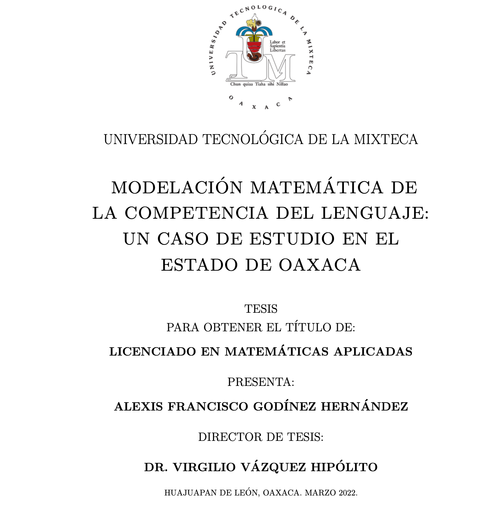
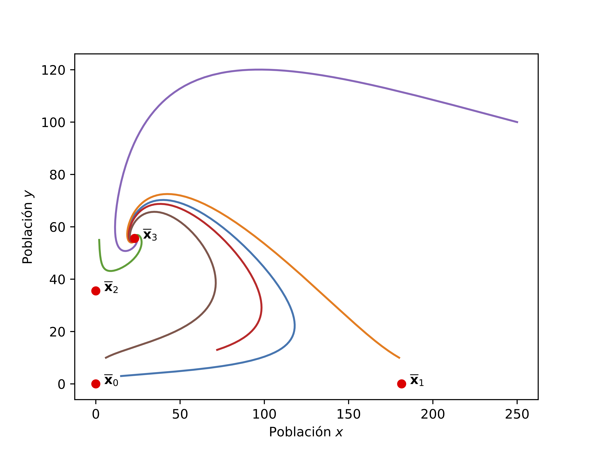

# modelacionTesisAlexisGodinez
Modelación matemática de la competencia del lenguaje un caso de estudio en el estado de oaxaca

## Acerca de 

Programas en python que se utilizaron en la tesis:

Modelación matemática de la competencia del lenguaje: Un caso de estudio en el estado de Oaxaca.

Tesis presentada en la Universidad Tecnológica de la Mixteca, el 25 de abril del 2022.

</img>

Los programas en python solo emplean el método numérico Rongue Kutta de orden 4 para estimar la solución de un sistema de ecuaciones diferenciales utilizado en el trabajo de titulación.

Para mayor información consultar el trabajo de tesis en la biblioteca de la Universidad Tecnológica de la Mixteca (https://www.utm.mx/biblioteca/).

Imagen ilustrativa de la simulación
</img>